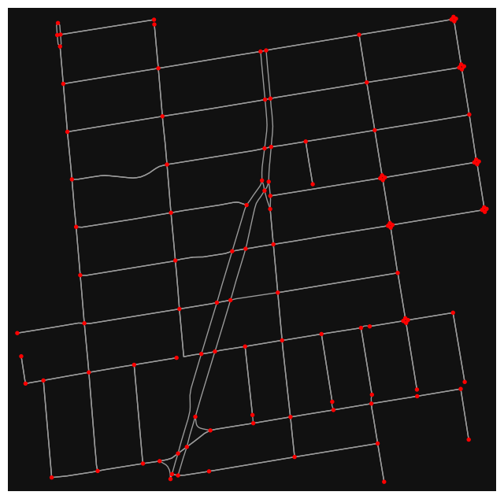

# OSMnx_try
Try using OSMnx for street network measurement

Using street network in Chapel Hill as an example, get familiar with OMSnx python library.

## Basic routing

## Network symplification 
|||

## Basic indicators
